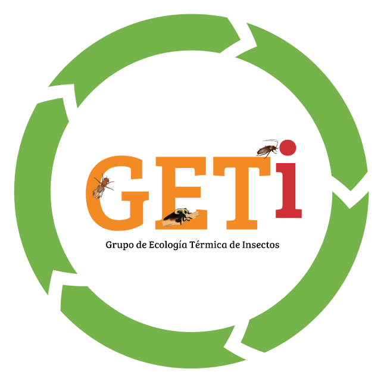

## Grupo de Ecología Térmica en Insectos



Les damos la bienvenida al **GETi**. Estudiamos, desde lo experimental, el efecto de la temperatura sobre diferentes aspectos de la ecología de los organismos. Utilizamos insectos como modelos de estudio.

Una parte central en nuestra aproximación es el OS. Nuestra filosofía es el cooperativismo. Compartir para aprender.

Somos un grupo de reciente formación que forma parte de un grupo más grande, el Grupo de Investigación en Ecofisiología de Parasitoides y otros Insectos (GIEP). Actualmente trabajamos 
(C) 2020 by Juli Carrillo or as otherwise noted. The copyright holder retains all rights to the photos or other published materials. The copyright holder prohibits other uses including copying or republishing any portion of the photos without the author’s permission

```markdown
Syntax highlighted code block

# Header 1
## Header 2
### Header 3

- Bulleted
- List

1. Numbered
2. List

**Bold** and _Italic_ and `Code` text

[Link](url) and 
```

For more details see [Basic writing and formatting syntax](https://docs.github.com/en/github/writing-on-github/getting-started-with-writing-and-formatting-on-github/basic-writing-and-formatting-syntax).

### Jekyll Themes

Your Pages site will use the layout and styles from the Jekyll theme you have selected in your [repository settings](https://github.com/josecrespo89/geti/settings/pages). The name of this theme is saved in the Jekyll `_config.yml` configuration file.

### Support or Contact

Having trouble with Pages? Check out our [documentation](https://docs.github.com/categories/github-pages-basics/) or [contact support](https://support.github.com/contact) and we’ll help you sort it out.
